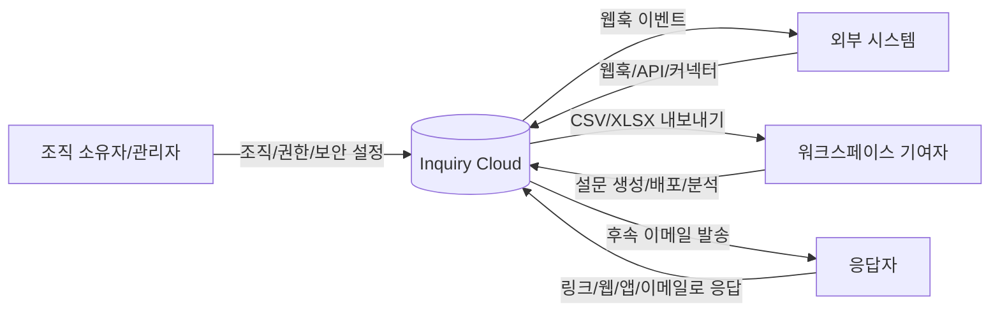

# Inquiry SaaS(Cloud) 기능 요구사항 명세서 (Software Requirements Specification)

---

## 문서 정보

| 항목 | 내용 |
|------|------|
| 프로젝트명 | Inquiry SaaS(Cloud) 기능 요구사항 명세 |
| 문서번호 | REQ-FB-2026-001 |
| 버전 | v1.0 |
| 작성자 | (작성자 기입) |
| 작성일 | 2026년 02월 20일 |
| 검토자 | (검토자 기입) |
| 검토일 | ____년 __월 __일 |
| 보안등급 | □ 대외비 ■ 사내일반 □ 공개 |
| 상태 | ■ 초안 □ 검토중 □ 확정 |

---

## 목차

1. 프로젝트 개요  
2. 시스템 범위  
3. 기능 요구사항  
4. 비기능 요구사항  
5. 인터페이스 요구사항  
6. 제약 사항  
7. 용어 정의  
8. 변경 이력  

---

## 1. 프로젝트 개요

| 항목 | 내용 |
|------|------|
| 프로젝트 배경 | Inquiry Cloud(SaaS)를 활용하여 웹/앱/링크/이메일 채널에서 설문·피드백을 수집하고, 응답 데이터를 분석·자동화(웹훅/연동/후속 이메일)하여 조직의 경험관리(XM) 운영을 표준화한다. |
| 프로젝트 목적 | (1) 설문 제작/배포/응답관리/분석/연동을 단일 도구로 일원화 (2) 인앱 타게팅 기반의 고품질 피드백 확보 (3) 데이터 파이프라인 자동화를 통한 운영 비용 절감 (4) 보안·권한·감사 추적 기반의 엔터프라이즈 운영 체계 수립 |
| 적용 범위 | Inquiry Cloud 내 조직/팀/워크스페이스/프로젝트/설문/응답 전 기능과, SDK/태그매니저/API/웹훅/서드파티 연동을 포함한다. |
| 기대 효과 | 응답률·완료율 향상(타게팅/프리필/개인링크), 설문 피로도 감소(재노출 정책), 응답 처리 리드타임 단축(웹훅/연동/후속메일), 보안·컴플라이언스 강화(역할/2FA/SSO/감사로그) |

---

## 2. 시스템 범위

| 항목 | 내용 |
|------|------|
| 시스템 명칭 | Inquiry Cloud 기반 설문/피드백 운영 시스템 |
| 구축 유형 | ■ 신규 □ 고도화 □ 유지보수 |
| 운영 환경 | □ 온프레미스 ■ 클라우드(Inquiry Cloud) □ 하이브리드 |
| 연계 시스템 | Slack, Zapier, Notion, n8n, Make.com, Google Sheets, Airtable, 내부 CRM/CS, 데이터웨어하우스(선택), 이메일 발송 시스템(후속메일), Cal.com(일정 질문 유형) 등 |
| 제외 범위 | (1) Inquiry Self-hosting(인프라 설치/운영) (2) Inquiry가 제공하지 않는 별도 커스텀 대시보드 개발 (단, API로 외부 BI 연계는 포함) |

---

## 3. 기능 요구사항

> **우선순위 기준** — H(High/필수), M(Medium/권장), L(Low/선택). 난이도도 동일한 기준을 적용합니다.

### 3.1 기능 요구사항 목록

| 요구사항 ID | 분류 | 요구사항명 | 요구사항 내용 | 우선순위 | 난이도 | 비고 |
|------------|------|-----------|-------------|---------|-------|------|
| FR-001 | 계정/인증 | 회원가입/로그인/세션 | 이메일 기반 로그인, 세션 유지/만료, 비밀번호 재설정 | □H ■M □L | ■M □L □H | SaaS 기본 |
| FR-002 | 조직 | 조직(Organization) 관리 | 조직 생성/선택, 조직 단위 설정(일부는 소유자 권한) | ■H □M □L | ■M □L □H |  |
| FR-003 | 사용자관리 | 멤버 초대/온보딩 | 단건/대량(CSV) 초대, 초대 상태 관리(대기/만료/재전송) | ■H □M □L | ■M □L □H |  |
| FR-004 | 권한 | RBAC(조직/팀/워크스페이스) | 조직 역할(Owner/Manager/Billing/Member), 팀 역할/워크스페이스 권한(Read/Write/Manage) | ■H □M □L | ■H □M □L | EE 기능 포함 |
| FR-005 | 보안 | 2FA | TOTP 기반 2단계 인증 및 백업코드 | □H ■M □L | ■M □L □H | Enterprise |
| FR-006 | 보안 | SSO(OIDC/SAML) | OIDC 또는 SAML 기반 싱글사인온(엔터프라이즈) | □H ■M □L | ■H □M □L | Enterprise |
| FR-007 | 보안/감사 | 감사로그(Audit Logs) | 누가/언제/무엇을 변경했는지 감사 이벤트 기록 및 조회/연동 | □H ■M □L | ■H □M □L | Enterprise |
| FR-008 | 프로젝트 | 프로젝트 생성/관리 | 프로젝트 생성, 목록/검색, 아카이브/삭제, 프로젝트 단위 설정 | ■H □M □L | ■M □L □H |  |
| FR-009 | 환경 | 개발/프로덕션 환경 | 프로젝트별 Development/Test와 Production 환경 제공, 환경 전환, 설문 복사 | ■H □M □L | ■M □L □H |  |
| FR-010 | 연결 | 웹/앱 연결(Widget/SDK) | 환경ID 기반 스크립트/SDK 초기화, 데이터 수집/타게팅 기반 제공 | ■H □M □L | ■H □M □L |  |
| FR-011 | 설문 | 설문 생성(템플릿/스cratch) | 템플릿 선택 또는 빈 설문 생성, 설문 편집기 제공 | ■H □M □L | ■M □L □H |  |
| FR-012 | 설문 | 설문 유형 | Link Survey / Website & App Survey / Email Embedded Survey 지원 | ■H □M □L | ■M □L □H |  |
| FR-013 | 설문 | 질문 유형(전체) | 주소/연락처/텍스트/단일·다중선택/평점/CSAT/NPS/랭킹/날짜/매트릭스/파일업로드/이미지선택/CTA/동의/일정 등 | ■H □M □L | ■M □L □H | 일부 EE/환경 제약 |
| FR-014 | 편집기 | 설문 편집 UX | 질문 추가/삭제/재정렬, 고급설정(Question ID 등), 엔딩(Endings) 구성 | ■H □M □L | ■M □L □H |  |
| FR-015 | 디자인 | Styling Theme(프로젝트) | 프로젝트 전역 스타일(브랜드 컬러/텍스트/배경/로고) 설정 | ■H □M □L | ■M □L □H |  |
| FR-016 | 디자인 | 설문별 커스텀 스타일 | 개별 설문에서 전역 테마 오버라이드 및 App/Website CSS 변수 오버라이드 | □H ■M □L | ■M □L □H |  |
| FR-017 | 디자인 | 멀티미디어 배경 | 배경 업로드/Unsplash, 오버레이/애니메이션 배경 등 | □H ■M □L | ■M □L □H |  |
| FR-018 | 로직 | Conditional Logic | 조건(질문/변수/Hidden Field) + 액션(계산/필수화/점프) 기반 분기 | ■H □M □L | ■H □M □L |  |
| FR-019 | 로직 | Variables | 텍스트/숫자 변수 생성, 로직 액션으로 업데이트, 리콜에 활용 | □H ■M □L | ■M □L □H |  |
| FR-020 | 데이터 | Hidden Fields | 응답자 입력 없이 URL/SDK로 숨은 필드 세팅 및 분석/필터 | □H ■M □L | ■M □L □H |  |
| FR-021 | 개인화 | Recall Data | `@` 기반으로 이전 응답/Hidden Field/Variable를 질문·설명에 삽입 | □H ■M □L | ■M □L □H |  |
| FR-022 | 데이터수집 | Quota Management | 조건 기반 응답 쿼터(부분/완료 포함 옵션) 및 실시간 모니터링 | □H ■M □L | ■H □M □L | Enterprise |
| FR-023 | 다국어 | Multi-language Surveys | 설문 번역/언어별 제공(링크는 `lang=`, 앱은 user language) + RTL 지원 | □H ■M □L | ■H □M □L | Enterprise |
| FR-024 | 링크설문 | 공유/임베드 | 공유 모달(익명 링크, 링크 미리보기 메타, 임베드 코드/모드) 제공 | ■H □M □L | ■M □L □H |  |
| FR-025 | 링크설문 | Single-use links | 1회 응답 보장 링크 생성/CSV 다운로드/암호화 옵션 | □H ■M □L | ■M □L □H |  |
| FR-026 | 링크설문 | Personal Links | 세그먼트 기반 개인 링크 생성(만료일/CSV) 및 응답자 귀속 | □H ■M □L | ■H □M □L | Enterprise |
| FR-027 | 링크설문 | 접근제어 | PIN 보호, 이메일 검증 후 접근, 특정 질문부터 시작(startAt) | □H ■M □L | ■M □L □H | 일부 유료 기능 |
| FR-028 | 링크설문 | URL 기반 기능 | Source tracking(`source=`), Data prefilling(질문ID=값, skipPrefilled) | □H ■M □L | ■M □L □H |  |
| FR-029 | 인앱설문 | 타게팅/트리거 | 액션/속성/세그먼트/디바이스 기반 타게팅 + 트리거 조건 | ■H □M □L | ■H □M □L | EE 일부 |
| FR-030 | 인앱설문 | 재노출 정책 | Survey cooldown, 1회 노출/응답까지/조건 만족시 계속 등 | □H ■M □L | ■M □L □H |  |
| FR-031 | 인앱설문 | 사용자 식별 | userId 설정, 속성/언어 설정, 로그아웃 처리 | □H ■M □L | ■H □M □L | Enterprise |
| FR-032 | 보안 | Spam protection | reCAPTCHA v3 기반 스팸 차단(임계치 설정), 단 모바일 SDK 제한 | □H ■M □L | ■M □L □H | Enterprise |
| FR-033 | 자동화 | Response pipeline | 응답 생성/수정/완료 이벤트 기반 웹훅/연동/후속메일/오토포워드 | ■H □M □L | ■H □M □L | 일부 EE |
| FR-034 | 자동화 | Email Follow-ups | 응답/엔딩 기반 후속메일, 수신자 소스(검증메일/질문/Hidden/팀) | □H ■M □L | ■M □L □H | 유료 기능 |
| FR-035 | 운영 | 응답 관리 | 응답 목록/상세, 필터(메타/태그), 태깅, 메타데이터 확인 | ■H □M □L | ■M □L □H |  |
| FR-036 | 운영 | Partial submissions | 부분 응답(표시/질문별 상호작용) 자동 수집 및 드롭오프 분석 | □H ■M □L | ■M □L □H |  |
| FR-037 | 분석 | 요약/지표 | 완료율/분포, Rating CSAT, NPS, 기타 요약 인사이트 | ■H □M □L | ■M □L □H |  |
| FR-038 | 데이터 | Export | 응답+메타데이터 CSV/XLSX 내보내기 | ■H □M □L | ■M □L □H |  |
| FR-039 | API | REST API(클라이언트/관리) | Client API(무인증), Management API(API Key) + v2(beta) | ■H □M □L | ■H □M □L |  |
| FR-040 | 연동 | Webhooks | responseCreated/Updated/Finished 등 트리거로 외부 시스템 호출 | ■H □M □L | ■M □L □H |  |
| FR-041 | 연동 | 서드파티 커넥터 | Slack/Zapier/Notion/n8n/Make/Sheets/Airtable 등 | □H ■M □L | ■M □L □H | 제공 범위 변동 |
| FR-042 | 배포 | GTM 배포 | Google Tag Manager로 스크립트/식별/속성 세팅 | □H ■M □L | ■M □L □H |  |
| FR-043 | 확장 | Headless(커스텀 UI) | 설문 렌더링을 커스텀하고 Client API로 응답 제출(선택) | □H ■M □L | ■H □M □L | 고급 |
| FR-044 | 상용 | 브랜딩 제거 | “Powered by Inquiry” 제거(EE) | □H ■M □L | ■M □L □H | Enterprise |

### 3.2 유스케이스 다이어그램

아래는 본 문서 범위를 설명하기 위한 **텍스트 기반 유스케이스(mermaid)** 예시입니다. 실제 프로젝트에서는 별도 UML 도구 산출물을 별첨할 수 있습니다.

---

### 3.3 상세 기능 요구사항

> 본 절은 **Inquiry SaaS(Cloud)** 에서 “사용 가능한 기능”을 기준으로 작성하였다. 일부 항목은 플랜(Community/Enterprise) 또는 설정(예: reCAPTCHA, SSO)에 따라 활성화된다.  
> 각 요구사항은 “요구사항 내용”에 **사용 방법(운영 절차)** 과 **수락 기준**을 포함한다.

#### 3.3.1 계정/조직/권한 (FR-001 ~ FR-007, FR-044)

##### FR-001 회원가입/로그인/세션
- **설명**: 이메일 기반 계정 생성 및 로그인, 비밀번호 재설정, 세션 유지/만료.
- **사용자/권한**: 모든 사용자.
- **사용 방법**
  1. Inquiry Cloud 접속 → Sign up(이메일/비밀번호) 또는 Invite 링크로 가입
  2. 로그인 후 대시보드 접근
  3. 비밀번호 분실 시 “Forgot password”로 재설정 이메일 수신
- **예외**
  - 미인증/차단된 계정 로그인 시 오류 메시지 및 재시도 안내
- **수락 기준**
  - 유효 이메일로 가입/로그인 가능
  - 세션 만료 시 재로그인 요구
  - 비밀번호 재설정 링크는 1회성 또는 유효기간을 가진다(서비스 정책).

##### FR-002 조직(Organization) 관리
- **설명**: 하나의 조직 단위로 멤버/프로젝트/설정 관리.
- **사용자/권한**: Owner/Manager 중심.
- **사용 방법**
  1. 좌측 상단 조직 드롭다운(또는 Settings)에서 조직 선택/설정 접근
  2. 조직 설정(일반/접근제어/API Key/브랜딩 등)에서 항목 관리
- **수락 기준**
  - 조직 단위로 프로젝트/멤버가 분리되어 조회된다.

##### FR-003 멤버 초대/온보딩(단건/대량)
- **설명**: 조직 멤버를 이메일로 초대하고 역할을 부여한다.
- **사용 방법(단건)**
  1. Organization Settings → Access Control(또는 Members)
  2. Add member → 이름/이메일/역할 선택 → Invite
- **사용 방법(대량)**
  1. Add member → Bulk Invite 탭
  2. 샘플 CSV 다운로드 → Name, Email, Role 컬럼 채움 → 업로드
  3. 초대 발송 후 상태(대기/만료/수락) 모니터링
- **수락 기준**
  - 초대 메일 발송/재전송/취소가 동작한다.
  - CSV 초대 시 유효하지 않은 행은 오류로 분리된다(또는 제외 처리된다).

##### FR-004 RBAC(조직/팀/워크스페이스)
- **설명**: 조직 역할 + 팀/워크스페이스 권한으로 접근을 세분화한다.
- **조직 역할(예)**: Owner, Manager, Billing, Member
- **팀 역할/워크스페이스 권한(예)**: Team Admin/Contributor + Read/Read&Write/Manage
- **사용 방법**
  1. Organization Settings → Access Control에서 조직 역할 관리
  2. 팀/워크스페이스 관리 화면에서 워크스페이스별 권한(Read/Write/Manage) 부여
- **보안/규칙**
  - 권한 상승 방지(예: Manager는 Owner 초대 불가 등) 정책을 준수한다.
- **수락 기준**
  - Read 권한 사용자는 설문/응답 조회만 가능하고 생성/수정/삭제 불가
  - Manage 권한 사용자는 설정/연동/API Key까지 관리 가능

##### FR-005 2FA
- **설명**: TOTP 기반 2단계 인증 및 백업코드로 계정을 보호한다(Enterprise).
- **사용 방법**
  1. 프로필 메뉴 → Profile Settings → Security
  2. Two-factor authentication 토글 ON
  3. 비밀번호 확인 → QR 스캔(또는 시크릿 키 입력) → 6자리 코드 검증
  4. 백업코드 저장(10개)
- **예외**
  - SSO 계정은 2FA 호환 제한이 있을 수 있다(서비스 정책에 따름).
- **수락 기준**
  - 2FA 활성화 후 로그인 시 TOTP 또는 백업코드가 추가로 요구된다.
  - 백업코드는 1회 사용 후 무효화된다.

##### FR-006 SSO(OIDC/SAML)
- **설명**: 조직 표준 인증 체계(OIDC/SAML)로 SSO 로그인 제공(Enterprise).
- **사용 방법(개념)**
  1. 조직 보안 설정에서 OIDC 또는 SAML 설정값(issuer, client id/secret 등) 등록
  2. Redirect URI 등 필수 값이 맞는지 확인 후 활성화
  3. 사용자 로그인 화면에 SSO 버튼 노출 및 인증 흐름 수행
- **수락 기준**
  - SSO로 로그인 성공 시 조직에 사용자 계정이 생성/연동된다(정책에 따라 invite 생략 여부 상이).

##### FR-007 감사로그(Audit Logs)
- **설명**: 사용자/시스템의 주요 행위를 감사 이벤트로 기록하고 추적한다(Enterprise).
- **요구사항**
  - 누가(actor)/무엇을(action)/어떤 대상(target)/결과(status)/시각(timestamp) 를 최소 포함
  - 민감정보는 마스킹 처리
- **수락 기준**
  - 주요 관리 이벤트(예: 웹훅 생성, 설문 수정 등)가 감사로그로 남는다.

##### FR-044 “Powered by Inquiry” 제거
- **설명**: 설문 UI 및 이메일 등에 표시되는 브랜딩을 제거(Enterprise).
- **수락 기준**
  - 활성화 시 설문 하단(또는 UI)에 “Powered by Inquiry”가 노출되지 않는다.

---

#### 3.3.2 프로젝트/환경/연결 (FR-008 ~ FR-010)

##### FR-008 프로젝트 생성/관리
- **설명**: 프로젝트는 설문/설정의 상위 컨테이너이며 조직 내 다수 존재 가능.
- **사용 방법**
  1. Dashboard → New Project(또는 Create Project)
  2. 프로젝트명/기본 설정 생성
  3. 프로젝트 목록에서 검색/정렬, 아카이브/삭제(권한 필요)
- **수락 기준**
  - 프로젝트별로 설문 목록/설정/연동이 분리된다.

##### FR-009 개발/프로덕션 환경
- **설명**: 프로젝트는 Development(테스트)와 Production(운영) 환경을 가진다.
- **사용 방법**
  1. Configuration → Website & App Connection에서 환경 토글(Development/Production)
  2. 환경별로 API key/Environment ID/설정이 독립적임을 확인
  3. 설문 목록에서 More actions → Copy to target environment로 설문 복사
- **수락 기준**
  - 테스트 응답이 운영 지표에 섞이지 않는다.
  - 설문 복사 시 대상 환경에 동일 구조 설문이 생성된다.

##### FR-010 웹/앱 연결(Widget/SDK)
- **설명**: Environment ID 기반으로 웹/앱에 Inquiry를 연동하여 인앱 설문을 노출하고 타게팅에 필요한 행동/속성을 전송한다.
- **사용 방법(웹)**
  1. Configuration → Website & App Connection에서 Environment ID 확인
  2. SDK(@inquiry/js 등)로 초기화 또는 `<script>` 스니펫 삽입
  3. 필요 시 userId/attributes/language/actions를 설정
- **사용 방법(GTM)**
  - FR-042 참조(태그로 초기화/식별 설정)
- **수락 기준**
  - 초기화 후, 타게팅이 일치하는 인앱 설문이 지정 트리거 시 노출된다.

---

#### 3.3.3 설문 제작(코어) (FR-011 ~ FR-023, FR-013 세부)

##### FR-011 설문 생성(템플릿/스크래치)
- **설명**: 템플릿(예: PMF, SUS, Contact Form 등) 기반 또는 빈 설문 생성.
- **사용 방법**
  1. Surveys → New Survey
  2. Template 선택 또는 Start from Scratch
  3. Survey Editor에서 Questions/Styling/Settings 구성 후 Publish
- **수락 기준**
  - 템플릿 선택 시 기본 질문·엔딩 구성이 자동으로 생성된다.

##### FR-012 설문 유형
- **Link Survey**: URL로 배포, 웹/모바일 어디서나 응답.
- **Website & App Survey**: SDK 연동 환경에서 인앱/웹 위젯 형태로 노출.
- **Email Embedded Survey**: 이메일 본문에 임베드 또는 링크 프리필 기반 응답 유도.
- **수락 기준**
  - 설문 유형별로 설정 탭에 해당 옵션이 노출된다(예: 인앱은 recontact, 링크는 verify email/pin 등).

##### FR-013 질문 유형(전체) — 카탈로그
> 질문 유형은 “응답 데이터 타입/검증/설정 UI”를 포함하여 동작해야 한다.

**공통 요구사항**
- 각 질문은 Title/Description(선택) 제공
- 필수 응답(Required) 옵션(가능한 유형에 한함)
- Advanced Settings에서 Question ID 확인/복사(링크 프리필·startAt 등에 사용)

**질문 유형 목록 및 요구사항(요약)**
1. **Free Text(오픈 텍스트)**: 입력 타입(Text/Email/URL/Number/Phone), Long answer 토글  
2. **Single Select(단일 선택)**: 옵션, “Other” 추가, 옵션 랜덤 정렬  
3. **Multi Select(다중 선택)**: 체크박스, 옵션 랜덤 정렬  
4. **Rating(평점)**: 아이콘(별/숫자/스마일), 범위(3~10), 라벨(하/상), CSAT 요약 표시  
5. **NPS(Net Promoter Score)**: 0~10 점수, 라벨, 색상 코딩 옵션  
6. **Ranking(순위)**: 옵션 최소 2개, 선택 시 자동 재정렬  
7. **Date(날짜)**: 포맷(MM-DD-YYYY / DD-MM-YYYY / YYYY-MM-DD)  
8. **Matrix**: 행/열(0~X), 라디오 선택  
9. **Contact Info(연락처)**: 이름/이메일/전화/회사 등 필드 토글 및 필수 설정  
10. **Address(주소)**: 주소1/2, 도시, 주/도, 우편번호, 국가 필드 토글 및 필수 설정  
11. **File Upload**: 다중 업로드, 최대 용량, 파일 확장자 제한  
12. **Picture Selection**: 이미지 업로드, 단/다중 선택, 이미지 용량 제한(예: 5MB)  
13. **Statement(CTA)**: 설명 카드 + 버튼(계속/외부 URL 이동)  
14. **Consent(동의)**: 동의/거부 기록(데이터 프리필 등과 호환)  
15. **Schedule a Meeting(일정 예약)**: Cal.com 등 일정 도구 기반 예약(제공 시)

- **수락 기준**
  - 질문 유형 변경 시 데이터 스키마/검증이 유형에 맞게 적용된다.
  - 링크 프리필 시 질문 유형별 유효성 검사가 수행된다.

##### FR-014 설문 편집 UX(엔딩/고급설정 포함)
- **설명**: 질문 추가/삭제/순서 변경, 엔딩(Thank you/Endings) 구성, 버튼 라벨 커스터마이즈 등.
- **사용 방법**
  1. Survey Editor → Questions 탭에서 질문 카드 편집
  2. 각 질문 하단 Advanced Settings에서 Question ID 등 확인
  3. Endings/Thank-you 카드에서 헤드라인/설명/버튼(링크) 설정
- **수락 기준**
  - 변경 후 Save/Publish 시 즉시 설문에 반영된다(환경별).

##### FR-015 Styling Theme(프로젝트 전역)
- **설명**: 프로젝트 전역 스타일을 설정해 모든 설문에 기본 적용.
- **사용 방법**
  1. Configuration → Look & Feel(Styling Theme)
  2. 브랜드 컬러/텍스트 컬러/배경(업로드 또는 Unsplash)/오버레이 설정
  3. 로고 업로드(링크 설문 페이지에 표시) 및 저장
- **수락 기준**
  - 새로 생성되는 설문은 전역 테마를 기본값으로 사용한다.

##### FR-016 설문별 커스텀 스타일(오버라이드)
- **설명**: 특정 설문만 전역 테마와 다른 스타일을 적용.
- **사용 방법**
  1. Survey Editor → Styling 탭
  2. Add Custom Styles 토글 ON → 옵션 조정 → Save
  3. App/Website 설문은 CSS 변수 오버라이드로 세밀 조정 가능(전역 CSS에 추가)
- **수락 기준**
  - 오버라이드 활성화된 설문은 전역 테마 변경의 영향을 받지(또는 최소화) 않는다.

##### FR-017 멀티미디어 배경
- **설명**: 설문 배경에 이미지/애니메이션을 적용하여 참여 유도.
- **사용 방법**
  - FR-015/016에서 배경 설정(업로드/Unsplash/애니메이션) 및 오버레이 조정
- **수락 기준**
  - 배경은 설문 페이지 로딩 시 자연스럽게 표시되며 가독성을 해치지 않는다(오버레이로 보완).

##### FR-018 Conditional Logic(로직 편집기)
- **설명**: 로직 블록(조건 + 액션)으로 분기/점프/계산/필수화 수행.
- **사용 방법**
  1. Survey Editor → Logic(또는 질문별 Logic)
  2. Add logic + → 조건 추가(질문/변수/Hidden Field)
  3. 액션 추가
     - Calculate: 변수에 계산 결과 저장
     - Require Answer: 특정 질문을 필수로 전환
     - Jump to Question: 특정 질문으로 점프
  4. Save
- **수락 기준**
  - 조건 충족 시 설정한 액션이 동일한 순서로 실행된다.
  - AND/OR 그룹 조건이 의도대로 평가된다.

##### FR-019 Variables
- **설명**: 설문 진행 중 업데이트 가능한 변수(텍스트/숫자)를 제공.
- **사용 방법**
  1. Questions 탭 하단 Variables → 변수 ID/타입/기본값 추가
  2. Logic에서 Calculate 액션으로 변수 업데이트
  3. Recall에서 변수 삽입(예: 최종 점수 노출)
- **수락 기준**
  - 변수 값이 로직 실행 후 즉시 반영된다.

##### FR-020 Hidden Fields
- **설명**: 응답자의 입력 없이 추가 데이터를 수집(예: plan=pro, screen=pricing).
- **사용 방법**
  1. Survey Editor → Questions 탭 하단 Hidden Fields 토글 ON
  2. Hidden field ID 추가
  3. URL 파라미터로 세팅(예: `?screen=pricing&plan=pro`) 또는 SDK init/attributes로 세팅(앱 설문)
- **수락 기준**
  - 응답 데이터에 hidden field가 포함되며, 필터/내보내기에서 확인 가능.

##### FR-021 Recall Data
- **설명**: 질문 텍스트/설명에 `@`로 개인화 값 삽입.
- **사용 방법**
  1. 질문/설명 입력창에서 `@` 입력
  2. 이전 질문/Hidden Field/Variable에서 값 선택
  3. 미리보기로 치환 동작 확인
- **수락 기준**
  - 삽입 위치에 값이 런타임에 치환되어 표시된다.

##### FR-022 Quota Management(Enterprise)
- **설명**: 특정 세그먼트/응답 조건별로 응답 수를 제한.
- **요구사항**
  - Hidden field 기반(예: region=europe) 또는 특정 질문 응답 기반 쿼터
  - 부분 응답 포함 여부 옵션
  - 실시간 모니터링(현재 카운트/진행률/상태)
- **수락 기준**
  - 쿼터 도달 시 해당 조건 응답 수집이 중단(또는 지정 정책 수행)된다.

##### FR-023 Multi-language Surveys(Enterprise)
- **설명**: 동일 설문에서 다국어 번역을 제공하고, 언어별로 표시되게 한다.
- **사용 방법**
  1. Configuration → Survey Languages → Edit languages → 언어/alias 추가
  2. Survey Editor 하단 Multiple Languages 토글 ON → default language 지정
  3. 질문/옵션/버튼 텍스트를 언어별로 번역
  4. 배포:
     - Link Survey: URL에 `lang=<alias>` 추가
     - App Survey: user language attribute 설정
- **수락 기준**
  - 지정 언어에서 번역이 없는 경우 노출 정책(미노출 등)이 문서대로 동작한다.
  - RTL 언어 선택 시 UI가 오른쪽→왼쪽으로 정상 렌더링된다.

---

#### 3.3.4 링크 설문(Link Surveys) (FR-024 ~ FR-028)

##### FR-024 공유/임베드(Share Modal)
- **설명**: 링크 설문은 공유 모달에서 다양한 배포 옵션을 제공한다.
- **필수 제공 항목**
  - Anonymous link 발급(기본)
  - Link Settings(링크 타이틀/설명/OG 이미지)
  - Embed in Web Page(iframe 코드)
  - Embed in Email(이메일 임베드 코드) + Preview/Send preview
  - Embed mode(여백/배경 최소화, `?embed=true` 또는 UI 토글)
  - iframe completion event(`inquirySurveyCompleted`) 수신 가능
- **사용 방법**
  1. 설문 Publish → Summary 페이지 → Share survey
  2. 탭별 설정값을 저장/복사/테스트
- **수락 기준**
  - 공유된 링크를 열면 설문이 즉시 노출되며 응답이 정상 저장된다.

##### FR-025 Single-use links
- **설명**: 1회 응답을 보장하는 링크를 생성한다.
- **사용 방법**
  1. Summary → Share survey → Anonymous Links
  2. Single Use Link 토글 ON
  3. (선택) URL Encryption ON → 생성 개수 지정 → CSV 다운로드
  4. (선택) Encryption OFF → 단일 suId를 수동/프로그램으로 부여
- **수락 기준**
  - 동일 링크로 2회 이상 제출이 차단된다.
  - 응답 메타데이터에서 suId를 확인 가능하다.

##### FR-026 Personal Links(Enterprise)
- **설명**: 연락처(Contacts)와 세그먼트 기반으로 개인별 고유 링크를 생성한다.
- **사용 방법(UI)**
  1. Contact Management에서 Segment 생성(조건: attributes/segments)
  2. Summary → Share survey → Personal Links 탭
  3. Segment 선택 → 만료일(선택) → Generate & download links(CSV)
- **운영 주의**
  - 생성된 CSV는 Inquiry에 영구 보관되지 않을 수 있으므로 안전 저장 필요.
- **수락 기준**
  - 개인 링크로 응답 시 해당 Contact에 응답이 귀속된다.
  - 만료일 이후 접근이 차단된다(정책에 따름).

##### FR-027 접근 제어(PIN / Verify Email / StartAt)
- **PIN 보호**
  - Settings → Response Options → Protect Survey with a PIN 토글 → 4자리 PIN 설정
- **이메일 검증**
  - Settings → Response Options → Verify Email Before Accessing Survey 토글
  - 응답자는 이메일 입력 → 검증 링크 메일 수신 → 링크로 접속
  - “Preview survey questions”는 비상호작용 프리뷰 제공 가능
- **StartAt(특정 질문부터 시작)**
  - 질문의 Question ID 복사 → URL에 `?startAt=<questionId>` 추가
- **수락 기준**
  - PIN이 틀리면 접근 불가 및 재시도 안내
  - 이메일 검증 미완료 시 설문 응답 불가
  - startAt 적용 시 지정 질문부터 시작한다.

##### FR-028 URL 기반 기능(Source tracking / Data prefilling)
- **Source tracking**
  - URL에 `?source=<캠페인명>`을 부여하고, 응답 메타데이터에서 출처를 조회/내보내기 한다.
- **Data prefilling**
  - URL에 `?<questionId>=<answer>&skipPrefilled=true|false` 형태로 프리필
  - 옵션형 질문은 option id 또는 라벨로 프리필 가능(권장: option id)
  - Validation 실패 시 해당 프리필은 무시되고 질문이 정상 노출
- **수락 기준**
  - source 값이 응답 메타데이터/내보내기에 포함된다.
  - 프리필 값이 유효하면 해당 질문이 자동 채워지며, `skipPrefilled=true`면 스킵된다.

---

#### 3.3.5 웹/앱 설문(Website & App Surveys) (FR-029 ~ FR-032)

##### FR-029 타게팅/트리거
- **설명**: 올바른 사용자(cohort)에게 올바른 시점(moment)에 설문을 노출한다.
- **타게팅 입력**
  - userId(식별), attributes(예: plan, role), segments
  - device/browser/country 등의 메타 정보
  - action(사용자 행동 이벤트)
- **사용 방법(개념)**
  1. SDK 초기화 후 식별/속성 세팅(FR-031)
  2. Inquiry에서 타게팅 조건(속성/세그먼트/행동)을 설정
  3. 지정 트리거(행동) 발생 시 설문 노출
- **수락 기준**
  - 조건이 불일치하면 설문은 노출되지 않는다.
  - 조건이 일치하면 설정된 트리거에 의해 노출된다.

##### FR-030 재노출 정책(Recontact Options)
- **설명**: 설문 피로도를 관리하기 위해 재노출 정책을 제공한다.
- **옵션(예)**
  - Show only once(기본)
  - Until they Submit a Response
  - Keep Showing while Conditions Match
  - Global waiting time(프로젝트 단위 쿨다운) 및 설문별 override
- **사용 방법**
  1. Survey Editor → Settings → Survey type=App Survey
  2. Recontact Options 섹션에서 정책 선택
- **수락 기준**
  - 정책별 노출 규칙이 문서 설명대로 동작한다.

##### FR-031 사용자 식별(User Identification)
- **설명**: 식별 사용자 기반으로 세그먼트/속성/언어를 활용해 정교한 타게팅을 수행한다(Enterprise).
- **사용 방법(SDK)**
  - userId: `inquiry.setUserId("<user-id>");`
  - attributes: `inquiry.setAttributes({ plan: "free", email: "..." });`
  - language: `inquiry.setLanguage("de");`
  - logout: `inquiry.logout();`
- **제약**
  - 속성 클래스 수(예: 150개/환경) 등 서비스 제한이 있을 수 있다.
- **수락 기준**
  - 설정한 userId/attributes가 대시보드의 사용자/응답에 반영된다.

##### FR-032 Spam protection(reCAPTCHA v3)
- **설명**: 자동화된 스팸 응답을 차단한다(Enterprise).
- **사용 방법**
  1. Survey Editor → Settings → Response Options → Spam protection 토글
  2. 임계치(threshold) 설정
- **제약**
  - Mobile SDK(React Native/iOS/Android)에서는 동작 제한이 있을 수 있다.
- **수락 기준**
  - 봇/스팸 응답이 일정 수준 차단되며 정상 응답은 통과한다.

---

#### 3.3.6 응답 운영/자동화 (FR-033 ~ FR-036, FR-034 세부)

##### FR-033 Response pipeline(웹훅/연동/오토포워드)
- **설명**: 응답 이벤트를 기반으로 자동 처리 파이프라인을 실행한다.
- **필수 트리거**
  - responseCreated / responseUpdated / responseFinished(또는 동등 이벤트)
- **실행 액션**
  - Webhook 호출(FR-040)
  - 서드파티 커넥터 실행(FR-041)
  - Email follow-up(FR-034)
  - Auto-forward after submission(Enterprise, 조직 정책에 따라 이메일/채널로 전달)
- **수락 기준**
  - 응답 이벤트 발생 시 설정된 액션이 누락 없이 실행된다(재시도/실패 처리 포함).

##### FR-034 Email Follow-ups(유료 기능)
- **설명**: 응답 완료 또는 특정 엔딩 도달 시 자동 이메일 발송.
- **수신자(To) 구성 옵션**
  - Verified Email(이메일 검증 단계)
  - Email 타입 Free Text 질문 응답
  - Contact Info 질문 응답
  - Hidden Fields 값
  - Team members / Myself
- **사용 방법**
  1. Survey Editor → Follow-ups 섹션 → New follow-up
  2. Trigger type(응답 기반/엔딩 기반) 선택
  3. To/Reply-to/Subject/Body 작성(기본 HTML 태그 지원)
  4. (선택) 응답 데이터 포함 옵션
  5. Save → 활성화
- **수락 기준**
  - 트리거 조건에 맞는 응답에서 이메일이 발송된다.
  - 수신자 소스가 유효하지 않으면 발송 실패 사유가 표시된다(또는 로그/알림 제공).

##### FR-035 응답 관리(Responses)
- **설명**: 응답 리스트/상세 보기 및 분류/검색/필터링 제공.
- **필수 기능**
  - 응답 카드/테이블 뷰
  - 필터(메타데이터, 태그, 질문 응답, hidden fields 등)
  - 메타데이터 툴팁(소스/URL/브라우저/OS/디바이스/국가/액션 등)
  - 태그 부여/생성(환경별 태그)
- **사용 방법**
  1. Survey → Responses 탭
  2. 응답 클릭 → 상세 확인
  3. Add Tag → 기존 선택 또는 신규 생성
  4. Filter → 조건 설정
- **수락 기준**
  - 태그/필터가 즉시 반영되며 내보내기에도 반영 가능하다(정책에 따라).

##### FR-036 Partial submissions
- **설명**: 설문이 “열렸으나 미완료”인 부분 응답을 추적한다.
- **데이터 수집 포인트**
  - display created(노출)
  - question partially answered(질문별 상호작용)
- **수락 기준**
  - 질문별 이탈 지점을 확인할 수 있다(요약 또는 데이터 내보내기/API).

---

#### 3.3.7 분석/리포팅/데이터 (FR-037 ~ FR-039)

##### FR-037 요약/지표
- **설명**: 설문 요약 페이지에서 핵심 지표를 제공한다.
- **예**
  - 완료율, 응답 수, 분포
  - Rating 질문의 CSAT 요약(트래픽 라이트)
  - NPS 계산 및 분류(프로모터/패시브/디트랙터)
- **수락 기준**
  - 동일 설문/환경에서 지표가 응답 데이터와 일관된다.

##### FR-038 Export(CSV/XLSX)
- **설명**: 응답과 메타데이터를 파일로 내보낸다.
- **수락 기준**
  - CSV/XLSX 내보내기 시 질문별 컬럼 및 메타데이터 컬럼이 포함된다.
  - 필터 적용 상태에서 내보내기가 가능하다(정책/UI에 따름).

##### FR-039 REST API(클라이언트/관리)
- **Client API(무인증)**
  - 설문 표시/응답 생성·업데이트, 사용자 생성/식별(환경ID 기반)
  - 예: `POST /api/v1/client/{environmentId}/user`
- **Management API(API Key)**
  - Survey/Response/Webhook/Contacts/Attributes/Action classes 등 관리
  - API Key 권한(Read/Write/Manage) 및 프로젝트/환경 범위 설정
- **수락 기준**
  - API Key는 생성 시 1회 노출되며 이후 재조회 불가
  - Client API는 브라우저/모바일에서 안전하게 사용 가능(민감 권한 미제공)

---

#### 3.3.8 연동/배포/확장 (FR-040 ~ FR-043, FR-042 세부)

##### FR-040 Webhooks
- **설명**: 응답 이벤트를 외부 URL로 전달한다.
- **요구사항**
  - 트리거 선택(responseCreated/Updated/Finished)
  - payload에 응답 데이터/메타/태그/변수/언어/상태 포함
- **수락 기준**
  - 정상 트리거에서 HTTP 요청이 발송되고, 실패 시 재시도/오류 확인 수단이 있다(정책에 따름).

##### FR-041 서드파티 커넥터
- **설명**: Slack/Zapier/Notion/n8n/Make/Sheets/Airtable 등 커넥터로 자동화.
- **요구사항**
  - 커넥터는 Response pipeline과 연동되어 이벤트 기반으로 동작
  - 커넥터 제공 범위는 Inquiry 업데이트로 변동 가능(운영 시 최신 목록 확인)
- **수락 기준**
  - 지정 커넥터로 응답 데이터가 전달/기록된다.

##### FR-042 GTM 배포
- **설명**: 코드 수정 없이 GTM으로 Inquiry 초기화 및 사용자 식별/속성 전송.
- **사용 방법(요약)**
  1. GTM Custom HTML 태그로 초기화 스크립트 삽입(environmentId, appUrl)
  2. Data Layer 변수를 만들어 userId/attrs를 세팅
  3. 별도 태그로 `setUserId`, `setAttributes` 호출
- **수락 기준**
  - 배포 후 웹사이트에서 인앱 설문 노출 및 타게팅이 정상 동작한다.

##### FR-043 Headless(커스텀 UI)
- **설명**: 설문 UI를 자체 구현하고 Inquiry Client API로 응답 제출.
- **요구사항**
  - 질문 타입 렌더링(오픈텍스트/선택/평점 등), 분기 로직, 검증, 진행률 추적
  - 응답 제출: `POST /api/v1/client/{environmentId}/responses` 등(정확한 엔드포인트는 버전에 따라 상이)
- **수락 기준**
  - 커스텀 UI에서 제출한 응답이 Inquiry 응답 목록/분석/웹훅/후속메일 파이프라인에 동일하게 반영된다.

---

#### 3.3.9 상용/구독 (FR-044 외)
- **설명**: 플랜별 기능 활성화(Enterprise 기능 포함) 및 프로젝트 수(“Unlimited projects” 등) 정책은 계약/플랜에 따라 달라질 수 있다.
- **수락 기준**
  - 구독 상태에 따라 기능 토글/메뉴가 활성화/비활성화 되며, 사용자가 인지 가능한 안내가 제공된다.

---

### (부록 A) 기능-플랜 매트릭스(요약)

> 아래 매트릭스는 “Community vs Enterprise” 기준의 대표 예시이며, Cloud 플랜(Free/Startup/Enterprise 등)은 계약에 따라 달라질 수 있다.

- Community에서도 제공되는 주요 기능: 무제한 설문, API, SDK, Website&App/Link/Email embed, 고급 로직, 커스텀 스타일, 리콜, 멀티미디어 배경, 파일업로드, Hidden fields, Single-use links, PIN, Webhooks, Email follow-ups 등
- Enterprise 추가 기능: 브랜딩 제거, Teams/RBAC, Contacts & Segments, Personal links, Quota, Audit logs, OIDC/SAML SSO, 2FA, reCAPTCHA, White-label email, Support SLA 등

---

## 4. 비기능 요구사항

| 요구사항 ID | 분류 | 요구사항명 | 요구사항 내용 | 측정 기준 |
|------------|------|-----------|-------------|---------|
| NFR-001 | 성능 | 설문 로딩 | 링크/인앱 설문 UI 초기 로딩은 사용자 경험을 저해하지 않도록 최적화한다. | 초기 로딩(캐시 후) 평균 ≤ 2초 |
| NFR-002 | 성능 | API 응답 | Management API/Client API는 일반 사용 구간에서 지연이 최소화되어야 한다. | 평균 응답 ≤ 2초(일반), p95 ≤ 5초 |
| NFR-003 | 가용성 | 서비스 가용률 | SaaS 운영 환경은 고가용성을 제공해야 한다. | 99.9% 이상(연간, 목표) |
| NFR-004 | 복구 | 백업/복구 | 중요한 데이터는 정기 백업 및 복구 절차가 존재해야 한다. | 일 1회 이상 암호화 백업, 복구 테스트 주기 운영(정책) |
| NFR-005 | 보안 | 전송구간 암호화 | 관리자/응답자 트래픽은 TLS로 보호되어야 한다. | HTTPS 강제, 최신 TLS |
| NFR-006 | 보안 | 접근통제 | RBAC/2FA/SSO 등 계정 보안 기능을 제공한다(플랜별). | 무단 접근 시도 차단/감사 추적 |
| NFR-007 | 보안 | 민감정보 최소화 | 웹훅/로그/내보내기에서 민감정보 취급 정책을 준수한다. | 마스킹/권한 기반 접근 |
| NFR-008 | 컴플라이언스 | 개인정보/규제 준수 | GDPR 등 관련 규정 준수(서비스 정책 범위 내). | 개인정보 처리방침/보안문서 참조 |
| NFR-009 | 호환성 | 브라우저/디바이스 | 응답자 UI는 주요 브라우저/모바일에서 동작해야 한다. | 최신 Chrome/Edge/Safari/Firefox, iOS/Android WebView(권장) |
| NFR-010 | 유지보수성 | 설정 변경 추적 | 설정 변경 이력 추적(감사로그) 및 문제 분석(로그)이 가능해야 한다. | 감사 이벤트/에러 eventId 등 제공 |

---

## 5. 인터페이스 요구사항

| 요구사항 ID | 인터페이스명 | 연계 시스템 | 인터페이스 내용 | 방식 | 비고 |
|------------|------------|-----------|--------------|------|------|
| IFR-001 | Client API | 웹/앱 클라이언트 | 설문 표시/응답 생성·업데이트/사용자 식별 | ■API □DB □File | 무인증, environmentId 기반 |
| IFR-002 | Management API | 백엔드/운영도구 | 설문/응답/웹훅/연락처 등 관리 | ■API □DB □File | x-api-key 필요 |
| IFR-003 | Webhook | 자동화 플랫폼 | 응답 이벤트를 외부 URL로 전달 | ■API □DB □File | 응답 파이프라인 |
| IFR-004 | SDK(@inquiry/*) | 웹 프론트 | 인앱 설문 위젯/식별/속성/액션 전송 | ■API □DB □File | 프레임워크별 가이드 |
| IFR-005 | GTM | Google Tag Manager | 스크립트 초기화/식별/속성 세팅 | ■API □DB □File | 코드 수정 최소화 |
| IFR-006 | Email Embed | 이메일 서비스 | 이메일 내 임베드 HTML/프리필 링크 | □API □DB ■File | 클라이언트 호환성 주의 |
| IFR-007 | Export | BI/분석 | CSV/XLSX 내보내기 | □API □DB ■File | 메타/태그 포함 |
| IFR-008 | SSO | IdP(AzureAD 등) | OIDC/SAML 인증 연동 | ■API □DB □File | Enterprise |
| IFR-009 | reCAPTCHA | Google | 스팸 방지 검증 | ■API □DB □File | Enterprise, 모바일 SDK 제한 |

---

## 6. 제약 사항

| 항목 | 내용 |
|------|------|
| 기술적 제약 | (1) reCAPTCHA 기반 스팸 방지는 Mobile SDK에서 제한될 수 있음 (2) Headless 구현 시 UI/로직/검증을 자체 구현해야 함 (3) 커넥터/연동 목록은 제품 업데이트로 변경될 수 있음 |
| 법적/규제 제약 | (1) 개인정보보호법/정보통신망법/GDPR 등 준수 필요 (2) 설문 수집 항목 최소화 및 민감정보 수집 시 별도 동의/보관정책 필요 |
| 비용 제약 | Enterprise 기능(SSO/2FA/감사로그/세그먼트/Personal links/Quota 등)은 유료일 수 있음. Cloud 플랜별 한도(MTU 등) 확인 필요 |
| 일정 제약 | (1) SDK/태그매니저 연동은 서비스 배포 일정과 연계 (2) 기존 설문/데이터 마이그레이션은 별도 계획 수립 필요 |

---

## 7. 용어 정의

| 용어/약어 | 정의 | 비고 |
|---------|------|------|
| Organization | Inquiry의 최상위 단위. 멤버/프로젝트/설정을 포함 | 조직 |
| Project | 설문과 설정을 묶는 단위. 환경(Dev/Prod)을 포함 | 프로젝트 |
| Environment | 동일 프로젝트 내 데이터/설정이 분리된 공간(Dev/Prod) | 환경 |
| Link Survey | URL로 배포되는 설문 | 링크 설문 |
| Website & App Survey | SDK로 앱/웹에 노출되는 인앱 설문 | 인앱 설문 |
| Email Embedded Survey | 이메일에 임베드하거나 프리필 링크로 응답 유도 | 이메일 |
| Hidden Field | URL/SDK로 세팅되는 숨은 값(분석/필터용) | 숨은 필드 |
| Variable | 설문 진행 중 업데이트 가능한 변수(텍스트/숫자) | 변수 |
| Recall | `@`로 값(이전 응답/변수/hidden) 삽입 | 리콜 |
| Webhook | 이벤트 발생 시 외부로 HTTP 요청을 보내는 연동 방식 | 웹훅 |
| MTU | Monthly Tracked Users(추적 사용자 수) 등 과금 기준이 될 수 있는 지표 | 플랜 의존 |

---

## 8. 변경 이력

| 버전 | 일자 | 작성자 | 변경 유형 | 변경 내용 |
|------|------|-------|---------|---------|
| v1.0 | 2026-02-20 | (작성자) | ■ 신규 □ 수정 □ 삭제 | 최초 작성 |
